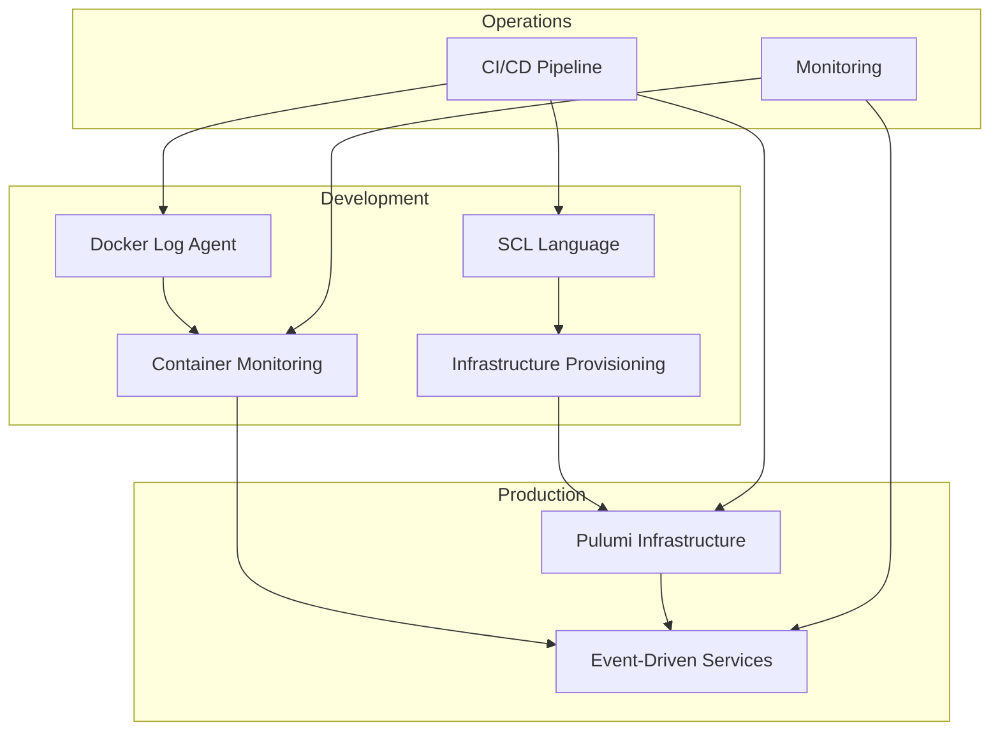

# DevOps Projects Overview

This document provides a detailed overview of all projects included in this DevOps portfolio repository, showcasing practical implementations of modern infrastructure management and automation practices.

## Project Categories

### 🔍 Monitoring & Observability
- **[Docker Log Agent](#docker-log-agent)** - Real-time container monitoring and alerting

### 🏗️ Infrastructure as Code
- **[Pulumi AWS Infrastructure](#pulumi-aws-infrastructure)** - Cloud infrastructure provisioning
- **[Terraform Configurations](#terraform-configurations)** - Multi-cloud infrastructure templates
- **[Ansible Playbooks](#ansible-playbooks)** - Configuration management automation

### 🚀 Microservices & Architecture
- **[Event-Driven Services](#event-driven-services)** - Microservices with messaging
- **[SCL Configuration Language](#scl-configuration-language)** - Custom infrastructure DSL

### 🛠️ DevOps Tools & Automation
- **[CI/CD Pipelines](#cicd-pipelines)** - Automated testing and deployment
- **[Automation Scripts](#automation-scripts)** - Shell scripts and utilities

---

## Project Details

### Docker Log Agent

**Location**: `projects/docker-log-agent/`  
**Technology Stack**: Go, Docker, Webhooks, YAML  
**Complexity**: Intermediate  

#### Overview
A production-ready Docker log monitoring agent that provides real-time container log analysis with intelligent alerting capabilities. This project demonstrates expertise in container monitoring, event-driven architecture, and system observability.

#### Key Features
- **Real-time Log Monitoring**: Continuously monitors Docker container logs
- **Pattern-based Detection**: Configurable error pattern matching (ERROR, WARN, FATAL, PANIC)
- **Webhook Integration**: Reliable alert delivery with retry logic and exponential backoff
- **Container Filtering**: Flexible filtering by container name or Docker labels
- **Resource Efficiency**: Minimal footprint (<100MB memory, <1% CPU idle)
- **Health Monitoring**: Built-in health check endpoints
- **Graceful Shutdown**: Proper signal handling and resource cleanup

#### Technical Highlights
```go
// Example: Intelligent log pattern matching
type LogPattern struct {
    Level     string `yaml:"level"`
    Pattern   string `yaml:"pattern"`
    Severity  string `yaml:"severity"`
}

// Webhook retry logic with exponential backoff
func (w *WebhookSender) SendWithRetry(alert Alert) error {
    for attempt := 0; attempt < w.maxRetries; attempt++ {
        if err := w.send(alert); err == nil {
            return nil
        }
        time.Sleep(time.Duration(math.Pow(2, float64(attempt))) * time.Second)
    }
    return fmt.Errorf("failed after %d attempts", w.maxRetries)
}
```

#### Use Cases
- **Production Monitoring**: Real-time error detection in containerized applications
- **DevOps Alerting**: Automated incident response and notification
- **Compliance Logging**: Audit trail and error tracking
- **Performance Monitoring**: Application health and error rate tracking

#### Deployment Options
- Docker Compose for development
- Kubernetes for production
- Standalone Docker container
- Integration with existing monitoring stacks

---

### Event-Driven Services

**Location**: `projects/event-driven/`  
**Technology Stack**: Go, NATS, Docker Compose, Caddy  
**Complexity**: Advanced  

#### Overview
A complete microservices architecture demonstrating event-driven communication patterns, service orchestration, and modern distributed system design principles.

#### Architecture Components
- **App One**: User management service
- **App Two**: Order processing service  
- **App Three**: Notification service
- **NATS**: Message broker for inter-service communication
- **Caddy**: Load balancer and reverse proxy

#### Key Features
- **Asynchronous Messaging**: Event-driven communication via NATS
- **Service Discovery**: Automatic service registration and discovery
- **Load Balancing**: Traffic distribution with Caddy
- **Container Orchestration**: Multi-service deployment with Docker Compose
- **Health Checks**: Service health monitoring and automatic recovery
- **Graceful Degradation**: Fault tolerance and circuit breaker patterns

#### Technical Architecture
```yaml
# Docker Compose service definition
services:
  app-one:
    build: ./app-one
    environment:
      - NATS_URL=nats://nats:4222
    depends_on:
      - nats
    healthcheck:
      test: ["CMD", "curl", "-f", "http://localhost:8080/health"]
      interval: 30s
      timeout: 10s
      retries: 3

  nats:
    image: nats:alpine
    ports:
      - "4222:4222"
      - "8222:8222"
```

#### Message Flow Example
```go
// Publisher (App One)
func (s *UserService) CreateUser(user User) error {
    if err := s.repo.Save(user); err != nil {
        return err
    }
    
    event := UserCreatedEvent{
        UserID: user.ID,
        Email:  user.Email,
        Timestamp: time.Now(),
    }
    
    return s.publisher.Publish("user.created", event)
}

// Subscriber (App Two)
func (s *OrderService) HandleUserCreated(event UserCreatedEvent) error {
    // Initialize user's order history
    return s.initializeUserOrders(event.UserID)
}
```

---

### SCL Configuration Language

**Location**: `projects/scl/lang/`  
**Technology Stack**: Go, ANTLR, SSH, YAML  
**Complexity**: Advanced  

#### Overview
A custom Domain-Specific Language (DSL) for infrastructure configuration management, combining the simplicity of declarative configuration with the power of programmatic logic.

#### Language Features
- **Dual Execution Modes**: Compile to bash scripts or interpret directly
- **SSH Integration**: Remote system administration capabilities
- **Type System**: Strong typing with compile-time validation
- **Control Flow**: Conditional logic, loops, and functions
- **Built-in Functions**: System administration operations

#### Syntax Example
```scl
import primary;

setting := configuration;
target := ["server.example.com"];
super_user = true;
on_error = rollback;
mode := interpret;

declare tools_ready: bool = check(target, ["docker", "nginx"]);
declare app_dir: string = "/opt/myapp";

fn deploy_app(){
    if tools_ready {
        primary.print("Server is ready");
        copy("config/app.conf", "/etc/myapp/app.conf");
        create("/var/log/myapp", "access.log", "644");
        service("restart", "nginx");
    } else {
        primary.print("Installing tools...");
        package("install", "docker");
        package("install", "nginx");
    }
}

fn main(){
    deploy_app();
    primary.print("Deployment complete!");
}
```

#### Advanced Operations
```scl
// System monitoring and management
fn system_maintenance() {
    sysinfo();                              // System information
    monitor();                              // Performance metrics
    firewall("allow", "80/tcp");           // Firewall management
    backup("backup", "/etc", "/backup/");   // Backup operations
    audit();                               // Security audit
}

// Network diagnostics
fn network_check() {
    nettest("google.com", "ping");
    nettest("github.com:443", "telnet");
    logs("/var/log/syslog", "error", 10);
}
```

#### Use Cases
- **Infrastructure Automation**: Server provisioning and configuration
- **Deployment Orchestration**: Application deployment workflows
- **System Administration**: Automated maintenance tasks
- **Configuration Management**: Consistent system configuration

---

### Pulumi AWS Infrastructure

**Location**: `infra/pulumi/event/`  
**Technology Stack**: Go, Pulumi, AWS  
**Complexity**: Intermediate  

#### Overview
Production-ready AWS infrastructure provisioning using Pulumi with Go, demonstrating Infrastructure as Code best practices and modular cloud architecture design.

#### Infrastructure Components
- **VPC**: Custom virtual private cloud with DNS support
- **Subnets**: Multi-AZ public subnets for high availability
- **Security Groups**: Layered security with HTTP, HTTPS, and SSH access
- **EC2 Instances**: Auto-scaling compute resources
- **Internet Gateway**: Public internet connectivity
- **Route Tables**: Optimized network routing

#### Modular Architecture
```go
// VPC Module
func NewVPC(ctx *pulumi.Context, name string, args VPCArgs) (*VPC, error) {
    vpc := &VPC{}
    
    // Create VPC
    vpc.VPC, err = ec2.NewVpc(ctx, name, &ec2.VpcArgs{
        CidrBlock:          pulumi.String(args.CidrBlock),
        EnableDnsHostnames: pulumi.Bool(true),
        EnableDnsSupport:   pulumi.Bool(true),
        Tags:               pulumi.StringMap(args.Tags),
    })
    
    // Create Internet Gateway
    vpc.InternetGateway, err = ec2.NewInternetGateway(ctx, name+"-igw", &ec2.InternetGatewayArgs{
        VpcId: vpc.VPC.ID(),
        Tags:  pulumi.StringMap(args.Tags),
    })
    
    return vpc, nil
}
```

#### Security Configuration
```go
// Security Group with layered access control
securityGroup, err := ec2.NewSecurityGroup(ctx, "web-sg", &ec2.SecurityGroupArgs{
    VpcId: network.VPC.ID(),
    Ingress: ec2.SecurityGroupIngressArray{
        &ec2.SecurityGroupIngressArgs{
            Protocol:   pulumi.String("tcp"),
            FromPort:   pulumi.Int(80),
            ToPort:     pulumi.Int(80),
            CidrBlocks: pulumi.StringArray{pulumi.String("0.0.0.0/0")},
        },
        &ec2.SecurityGroupIngressArgs{
            Protocol:   pulumi.String("tcp"),
            FromPort:   pulumi.Int(443),
            ToPort:     pulumi.Int(443),
            CidrBlocks: pulumi.StringArray{pulumi.String("0.0.0.0/0")},
        },
    },
})
```

---

### CI/CD Pipelines

**Location**: `.github/workflows/`  
**Technology Stack**: GitHub Actions, Docker, Go  
**Complexity**: Advanced  

#### Overview
Comprehensive CI/CD pipeline implementing modern DevOps practices including automated testing, security scanning, and multi-environment deployment.

#### Pipeline Features
- **Change Detection**: Smart build triggering based on file changes
- **Multi-Project Testing**: Parallel testing of different components
- **Security Scanning**: Vulnerability detection with Trivy
- **Code Quality**: Linting, formatting, and static analysis
- **Container Building**: Multi-architecture Docker image builds
- **Automated Deployment**: Staging and production deployments

#### Pipeline Stages
```yaml
# Example: Multi-stage pipeline with dependency management
jobs:
  changes:
    outputs:
      docker-log-agent: ${{ steps.changes.outputs.docker-log-agent }}
      event-driven: ${{ steps.changes.outputs.event-driven }}
  
  test-docker-log-agent:
    needs: [changes]
    if: needs.changes.outputs.docker-log-agent == 'true'
    steps:
      - name: Run tests
        run: go test -v -race -coverprofile=coverage.out ./...
      
      - name: Security scan
        uses: aquasecurity/trivy-action@master
        with:
          scan-type: 'fs'
          format: 'sarif'
```

---

## Project Interconnections

### Shared Infrastructure
- **Common Networking**: VPC and security groups shared across services
- **Monitoring Stack**: Centralized logging and metrics collection
- **CI/CD Pipeline**: Unified deployment and testing workflows

### Integration Points


### Technology Synergies
- **Go Ecosystem**: Consistent language across all custom tools
- **Container-First**: Docker-native development and deployment
- **Infrastructure as Code**: Version-controlled infrastructure
- **Event-Driven Architecture**: Scalable, loosely-coupled services

---

## Skills Demonstrated

### Technical Skills
- **Programming**: Go, Python, Shell scripting
- **Infrastructure**: AWS, Terraform, Pulumi, Ansible
- **Containers**: Docker, Docker Compose, container orchestration
- **Monitoring**: Log aggregation, metrics collection, alerting
- **CI/CD**: GitHub Actions, automated testing, deployment pipelines

### DevOps Practices
- **Infrastructure as Code**: Reproducible, version-controlled infrastructure
- **Configuration Management**: Automated system configuration
- **Monitoring & Observability**: Comprehensive system visibility
- **Security**: Vulnerability scanning, secure defaults, least privilege
- **Automation**: Reduced manual processes, improved reliability

### Architecture Patterns
- **Microservices**: Service decomposition and communication
- **Event-Driven**: Asynchronous, scalable system design
- **Twelve-Factor App**: Cloud-native application principles
- **Domain-Specific Languages**: Custom tooling and abstractions

---

## Getting Started

### Quick Setup
```bash
# Clone repository
git clone <repository-url>
cd DevopsProjects

# Set up environment
make setup
make verify

# Start development environment
make up-dev

# Deploy specific project
make docker-log-agent
make event-driven
```

### Learning Path
1. **Start with Docker Log Agent** - Learn container monitoring
2. **Explore SCL Language** - Understand custom tooling development
3. **Deploy Infrastructure** - Practice Infrastructure as Code
4. **Build Event-Driven Services** - Master microservices architecture
5. **Implement CI/CD** - Automate deployment pipelines

---

This portfolio demonstrates comprehensive DevOps engineering capabilities through practical, production-ready projects that showcase modern infrastructure management, automation, and cloud-native development practices.